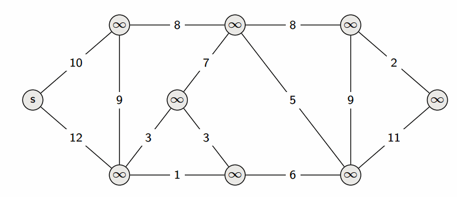

# SPF-Algorithm-by-NetworkX

_images source:  [Dijkstra's Algorithm](https://github.com/kdn251/interviews)_

I have been aquatinted with OSPF and IS-IS for many years, as both were core routing protocols in large scalable networks. And they continued to dominate the local regional or metro traffic manipulation during the label-driven MPLS era. Despite initially being assigned to serve different addressing stacks, they shared a most common algorithm--Dijkstra's Algorithm to calculate the shortest paths for services transferring between each node-pairs of the network and provide reliable alternative links.

Network engineers had never deep-dived into source-code-level details about deploying the algorithm and selecting the shortest path in the routers and switches. I came across it again when I did a case study on choosing the most optimized flying airlines between different airports by graphic-machine-learning. You could discover different trip plans by various criteria, for instance, based on flying distance or time.

The [notebook](./SPF-Algorithm-by-NetworkX.ipynb) was divided into two sections. It first demonstrated the SPF algorithm (Dijkstra's Algorithm) mechanism with Python. Then it illustrated how to use a Python graphic library--NetworkX, to obtain the best-flying airline with different considerations in the other.